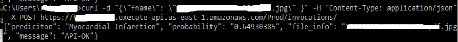
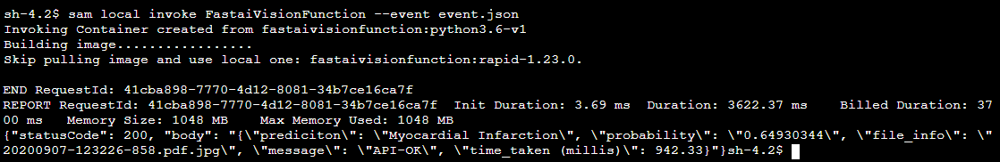

# End to End training and Productionizing of deep learning models

This project contains source code and supporting files for training and deploying deep learning model with fastai. The deployment is a serverless application that one can deploy with the SAM CLI. The structure of this project is as following:
- There is a training file training.ipynb and training.py which trains the model
- An application which makes it possible to use the trained model above for getting inferences. The source code is an example computer vision classification model that returns the class and probability in json format.

It includes the following files and folders.
- *training.ipynb* or training.py
- *vision* - Code for the application's Lambda function and Project Dockerfile. The exported fastai model vision classification model should be copied here and named `export.pkl`.
- *events* - Invocation events that you can use to invoke the function.
- *template.yaml* - A template that defines the application's AWS resources.

The application uses several AWS resources, including Lambda functions and an API Gateway API. These resources are defined in the `template.yaml` file in this project. You can update the template to add AWS resources through the same deployment process that updates your application code.

## Prediction of heart condition on an ECG image



## Perform the training using the script training.py
Use the source code and data to train a model. Output of this file is a pickle file which contains the model in *export.pkl*.

## Install the SAM CLI and Docker

The Serverless Application Model Command Line Interface (SAM CLI) is an extension of the AWS CLI that adds functionality for building and testing Lambda applications. It uses Docker to run your functions in an Amazon Linux environment that matches Lambda. It can also emulate your application's build environment and API.

To use the SAM CLI, you need the following tools.

* SAM CLI - [Install the SAM CLI](https://docs.aws.amazon.com/serverless-application-model/latest/developerguide/serverless-sam-cli-install.html) `sudo ./sam-installation/install`
* Docker - [Install Docker community edition](https://hub.docker.com/search/?type=edition&offering=community) - This is optional

You may need the following for local testing.
* [Python 3 installed](https://www.python.org/downloads/)

## Clone this project to your local machine

Clone this github repository to your machine where you have installed the SAM CLI and Docker.

```
git clone https://github.com/sinharitesh/lambda-container-app.git
```

## Export your fastai model

It is expected that you have already trained a fastai model. To export the model run the following command on your Jupyter notebook:

```
learn.export()
```

This will create a file called `export.pkl`. Copy this file to the `vision` directory in your project.

## Build and deploy your application

To build and deploy your application for the first time, run the following in your shell:

```bash
sam build
sam deploy --guided
```

The first command will build a docker image from a Dockerfile and then copy the source of your application inside the Docker image. The second command will package and deploy your application to AWS, with a series of prompts:

* **Stack Name**: The name of the stack to deploy to CloudFormation. This should be unique to your account and region, and a good starting point would be something matching your project name.
* **AWS Region**: The AWS region you want to deploy your app to.
* **Confirm changes before deploy**: If set to yes, any change sets will be shown to you before execution for manual review. If set to no, the AWS SAM CLI will automatically deploy application changes.
* **Allow SAM CLI IAM role creation**: Many AWS SAM templates, including this example, create AWS IAM roles required for the AWS Lambda function(s) included to access AWS services. By default, these are scoped down to minimum required permissions. To deploy an AWS CloudFormation stack which creates or modified IAM roles, the `CAPABILITY_IAM` value for `capabilities` must be provided. If permission isn't provided through this prompt, to deploy this example you must explicitly pass `--capabilities CAPABILITY_IAM` to the `sam deploy` command.
* **Save arguments to samconfig.toml**: If set to yes, your choices will be saved to a configuration file inside the project, so that in the future you can just re-run `sam deploy` without parameters to deploy changes to your application.

You can find your API Gateway Endpoint URL in the output values displayed after deployment.

## Use the SAM CLI to build and test locally

Build your application with the `sam build` command.

```bash
lambda-container-app$ sam build
```

The SAM CLI builds a docker image from a Dockerfile and then installs dependencies inside the docker image. The processed template file is saved in the `.aws-sam/build` folder.

Test a single function by invoking it directly with a test event. An event is a JSON document that represents the input that the function receives from the event source. Test events are included in the `events` folder in this project.

Run functions locally and invoke them with the `sam local invoke` command.



```bash
lambda-container-app$ sam local invoke FastaiVisionFunction --event event.json
```

The SAM CLI can also emulate your application's API. Use the `sam local start-api` to run the API locally on port 3000.

```bash
lambda-container-app$ sam local start-api
lambda-container-app$ curl http://localhost:3000/
```

The SAM CLI reads the application template to determine the API's routes and the functions that they invoke. The `Events` property on each function's definition includes the route and method for each path.

```yaml
      Events:
        FastaiVision:
          Type: Api
          Properties:
            Path: /invocations
            Method: post
```

## Fetch, tail, and filter Lambda function logs

To simplify troubleshooting, SAM CLI has a command called `sam logs`. `sam logs` lets you fetch logs generated by your deployed Lambda function from the command line. In addition to printing the logs on the terminal, this command has several nifty features to help you quickly find the bug.

`NOTE`: This command works for all AWS Lambda functions; not just the ones you deploy using SAM.

```bash
lambda-container-app$ sam logs -n FastaiVisionFunction --stack-name lambda-container-app --tail
```

You can find more information and examples about filtering Lambda function logs in the [SAM CLI Documentation](https://docs.aws.amazon.com/serverless-application-model/latest/developerguide/serverless-sam-cli-logging.html).


## Resources

Thanks to [fastai container sam app by Matt](https://github.com/mattmcclean/fastai-container-sam-app)
See the [AWS SAM developer guide](https://docs.aws.amazon.com/serverless-application-model/latest/developerguide/what-is-sam.html) for an introduction to SAM specification, the SAM CLI, and serverless application concepts.

Next, you can use AWS Serverless Application Repository to deploy ready to use Apps that go beyond hello world samples and learn how authors developed their applications: [AWS Serverless Application Repository main page](https://aws.amazon.com/serverless/serverlessrepo/)

## Notes
After doing SAM build, once can test the function with the command - `sam local invoke FastaiVisionFunction --event event.json`
If deploying a new application , use sam deploy --guided --capabilities = CAPABILITY_IAM
It is important that your AWS role should have proper access to various resources, otherwise deployment could fail.

Following could be useful:

Inline policy details:
{
    "Version": "2012-10-17",
    "Statement": [
        {
            "Sid": "FirstStatement",
            "Effect": "Allow",
            "Action": "ecr:InitiateLayerUpload",
            "Resource": "arn:aws:ecr:us-east-1:<account-id>:repository/ecr-dl-lambda"
        },
        {
            "Sid": "SecondStatement",
            "Effect": "Allow",
            "Action": "ecr:UploadLayerPart",
            "Resource": "arn:aws:ecr:us-east-1:<account-id>:repository/ecr-dl-lambda"
        },
        {
            "Sid": "Third",
            "Effect": "Allow",
            "Action": "ecr:CompleteLayerUpload",
            "Resource": "arn:aws:ecr:us-east-1:<account-id>:repository/ecr-dl-lambda"
        },
        {
            "Sid": "Fourth",
            "Effect": "Allow",
            "Action": "ecr:PutImage",
            "Resource": "arn:aws:ecr:us-east-1:<account-id>:repository/ecr-dl-lambda"
        }
    ]
}

The fastai lambda function should have access to S3 repo where Images are stored, this can be achieved with following:
get_S3 Role:
{
"Version": "2012-10-17",
"Statement": [
{
"Sid": "VisualEditor0",
"Effect": "Allow",
"Action": "s3:GetObject",
"Resource": "arn:aws:s3:::*/*"
},
{
"Sid": "VisualEditor1",
"Effect": "Allow",
"Action": [
"s3:DescribeJob",
"s3:ListBucket"
],
"Resource": [
"arn:aws:s3:::*",
"arn:aws:s3:*:<account-id>:job/*"
]
},
{
"Sid": "VisualEditor2",
"Effect": "Allow",
"Action": "s3:ListStorageLensConfigurations",
"Resource": "*"
}
]
}

